```mermaid
graph TD
    classDef batman fill:#2D2D2D,stroke:#FEE600,stroke-width:2px,color:white
    classDef waynetech fill:#000000,stroke:#00AAFF,stroke-width:2px,color:#00AAFF
    
    A[Kishore Ram M: The Code Knight] --> B[Backend Bat-Arsenal]
    A --> C[Frontend Bat-Gadgets]
    A --> D[DevOps Bat-Belt]
    A --> E[Database Bat-Computer]
    A --> F[Cloud Bat-Signal]
    
    B --> B1[Java: Power of the Cowl]
    B --> B2[Spring Boot: The Utility Belt]
    B --> B3[Microservices: Batmobile Architecture]
    B --> B4[Kafka: The Silent Messenger]
    B --> B5[RabbitMQ: The Quick Bat-Relay]
    
    C --> C1[React: The Bat-Visor]
    C --> C2[Redux: The Detective's Mind]
    C --> C3[Next.js: The Bat-Glider]
    C --> C4[TailwindCSS: The Bat-Suit]
    C --> C5[JavaScript: Bat-Gadgetry]
    
    D --> D1[Docker: The Bat-Containment]
    D --> D2[Kubernetes: The Bat-Orchestrator]
    D --> D3[Jenkins: Alfred Pennyworth]
    D --> D4[GitHub Actions: The Bat-Automation]
    D --> D5[CI/CD: The Wayne Manor Protocols]
    
    E --> E1[PostgreSQL: The Bat-Archives]
    E --> E2[MongoDB: The Bat-Collection]
    E --> E3[MySQL: The Legacy Systems]
    E --> E4[Redis: The Bat-Cache]
    
    F --> F1[AWS: The Wayne Enterprises Cloud]
    F --> F2[GCP: The Bat-Network]
    F --> F3[Firebase: The Bat-Beacon]
    
    class A,B,C,D,E,F batman
    class B1,B2,B3,B4,B5,C1,C2,C3,C4,C5,D1,D2,D3,D4,D5,E1,E2,E3,E4,F1,F2,F3 waynetech
```

<div align="center">
  
#  Kishore Ram M 

<!-- Batman mask border effect -->
<div style="border: 4px solid #FFFF00; border-radius: 50px; padding: 10px; background: linear-gradient(145deg, #000000, #2D2D2D);">
</a>
</div>

<p align="center">
  <a href="https://linktr.ee/yourusername">
    
  </a>
</p>

<a href="https://linkedin.com/in/kishoreramm"></a>
<a href="https://instagram.com/thekrm"></a>
<a href="mailto:mrkisho65@gmail.com"></a>
<a href="https://github.com/kishoreram-m"></a>

[](https://github.com/kishoreram-m)


</div>

<!-- Batman transition -->


<div align="center">
  
</div>

<p align="center">
  
</p>

---

<h2 align="center">
   
  I'm not the developer Gotham deserves, but the one it needs right now 
  
</h2>

<!-- BATMAN QUOTE SECTION -->
<table>
  <tr>
    <td>
      
    </td>
    <td>
      <div align="center">
        
      </div>
    </td>
    <td>
      
    </td>
  </tr>
</table>

##  My Bat-Tech Arsenal



<!-- BAT-SIGNAL DIVIDER -->
<p align="center">
  
</p>

##  Bat-Projects in Progress

<div align="center">
  <table>
    <tr>
      <td width="50%">
        <h3 align="center">Mission: Bat-Microservices</h3>
        <p align="center">
          <a href="#" target="_blank">
            
          </a>
        </p>
        <p><strong>Building Gotham's next-gen resilient backend infrastructure with Spring Boot, Kafka, and Kubernetes — because when the night is darkest, your systems need to stay online.</strong></p>
      </td>
      <td width="50%">
        <h3 align="center">The Batcave: Command Center</h3>
        <p align="center">
          <a href="#" target="_blank">
            
          </a>
        </p>
        <p><strong>Architecting a Wayne Enterprises-grade dashboard system with real-time monitoring capabilities that would make Lucius Fox proud.</strong></p>
      </td>
    </tr>
    <tr>
      <td width="50%">
        <h3 align="center">Gotham City API</h3>
        <p align="center">
          <a href="#" target="_blank">
            
          </a>
        </p>
        <p><strong>Crafting elegant RESTful APIs with Spring Boot that are as reliable as the Bat-Signal and as efficient as the Batmobile.</strong></p>
      </td>
      <td width="50%">
        <h3 align="center">Wayne Enterprise Database</h3>
        <p align="center">
          <a href="#" target="_blank">
            
          </a>
        </p>
        <p><strong>Designing high-performance PostgreSQL database architectures that could store all of Batman's secrets securely.</strong></p>
      </td>
    </tr>
  </table>
</div>

<!-- BATMAN CITY SKYLINE -->
<p align="center">
  
</p>

##  Bat-Tech Mastery

<div align="center">


<!-- Batman-styled skills with progress bars -->
<table>
  <tr>
    <th>Tech Category</th>
    <th>Mastery Level</th>
    <th>Tools of the Trade</th>
  </tr>
  <tr>
    <td><b>🦇 Batcave Backend</b></td>
    <td>
      
    </td>
    <td>
       
       
       
      
    </td>
  </tr>
  <tr>
    <td><b>🦇 Wayne Tech Frontend</b></td>
    <td>
      
    </td>
    <td>
       
       
       
      
    </td>
  </tr>
  <tr>
    <td><b>🦇 Bat-Belt DevOps</b></td>
    <td>
      
    </td>
    <td>
       
       
       
      
    </td>
  </tr>
  <tr>
    <td><b>🦇 Bat-Computer Database</b></td>
    <td>
      
    </td>
    <td>
       
       
       
      
    </td>
  </tr>
  <tr>
    <td><b>🦇 Bat-Signal Cloud</b></td>
    <td>
      
    </td>
    <td>
       
      
      
    </td>
  </tr>
</table>


</div>

<!-- BAT DIVIDER -->
<p align="center">
  
</p>

##  GitHub Analytics

<div align="center">
  
</div>

<div align="center">
  
  
</div>

<div align="center">
  
</div>

<div align="center">
  
</div>

<!-- BATMAN QUOTES SECTION -->
<div align="center">
  <table width="100%">
    <tr>
      <td align="center" width="50%">
        
        <p><i>"Why do we code? So we can see our pull requests being merged, master."</i></p>
      </td>
      <td align="center" width="50%">
        
        <p><i>"It's not about the commits, it's about sending a message. Everything builds."</i></p>
      </td>
    </tr>
  </table>
</div>

<!-- BATMAN CODING PRINCIPLES -->
<details>
  <summary><h3>🦇 The Dark Knight's Coding Principles</h3></summary>
  <div align="center">
    <table>
      <tr>
        <th>Principle</th>
        <th>Batman Says</th>
      </tr>
      <tr>
        <td>Clean Code</td>
        <td><i>"The code is not who we are underneath, but what the next developer reads that defines us."</i></td>
      </tr>
      <tr>
        <td>Debugging</td>
        <td><i>"Sometimes bugs need to be hunted in the shadows."</i></td>
      </tr>
      <tr>
        <td>Testing</td>
        <td><i>"I test in darkness, so your application can run in the light."</i></td>
      </tr>
      <tr>
        <td>Deployment</td>
        <td><i>"It's not about deploying. It's about deploying what's right."</i></td>
      </tr>
      <tr>
        <td>Architecture</td>
        <td><i>"A million microservices aren't intimidating if you organize them correctly."</i></td>
      </tr>
    </table>
  </div>
</details>

---

##  The Kishore Philosophy

<div align="center">
  
</div>

```java
@WayneTechInnovation
public class KishoreRam implements BatmanOfCode {
    
    @Override
    public Solution solveComplexProblems(Challenge challenge) {
        if (challenge.getDifficulty() == Difficulty.IMPOSSIBLE) {
            // "It's not who I am underneath, but what I code that defines me."
            return new Solution(Strategy.INNOVATIVE, Approach.SCALABLE);
        }
        
        // "Why do we fall, sir? So that we can learn to pick ourselves up."
        return new Solution(Strategy.RESILIENT, Approach.BATTLE_TESTED);
    }
    
    @BatSignal
    public void respondToProductionIssues(Alert alert) {
        if (alert.getSeverity() == Severity.CRITICAL) {
            // "I'm whatever Gotham needs me to be."
            deployFix(alert);
            scaleInfrastructure();
            notifyCommissioner(); // AKA the project manager
        }
    }
    
    @Override
    public void codeReview(PullRequest pr) {
        if (pr.hasSecurityVulnerabilities()) {
            // "This city needs me."
            rejectWithFeedback(pr, "Security is non-negotiable in Gotham.");
            return;
        }
        
        if (pr.passesAllTests() && pr.followsCodeStandards()) {
            // "You either die a hero or live long enough to see yourself become the maintainer."
            approveAndMerge(pr);
        }
    }
    
    // "Some men just want to watch the world build successfully."
}
```

> **"It's not just who I am underneath, but what I code that defines me."**  
> 
> I don't just deploy apps - I unleash digital justice. My microservices aren't merely connected; they're a vigilant network protecting your data like Batman protects Gotham. When others push code, I architect digital empires with the strategic mind of Bruce Wayne and the technical precision of Lucius Fox.
> 
> **"Why do we build distributed systems? So when one node falls, the network remains standing."**

<!-- WAYNE TECH SKILLS BREAKDOWN -->
<details>
  <summary><h3>🦇 Wayne Tech Specialized Skills</h3></summary>
  <div align="center">
    <table>
      <tr>
        <th>Domain</th>
        <th>Expertise</th>
        <th>Experience</th>
      </tr>
      <tr>
        <td>Microservices Architecture</td>
        <td>Spring Cloud, Netflix OSS, Service Mesh</td>
        <td>⭐⭐⭐⭐⭐</td>
      </tr>
      <tr>
        <td>Distributed Systems</td>
        <td>Kafka, RabbitMQ, Event Sourcing</td>
        <td>⭐⭐⭐⭐⭐</td>
      </tr>
      <tr>
        <td>Cloud Deployments</td>
        <td>AWS ECS, EKS, GCP GKE, Terraform</td>
        <td>⭐⭐⭐⭐</td>
      </tr>
      <tr>
        <td>Container Orchestration</td>
        <td>Kubernetes, Docker Swarm, Helm</td>
        <td>⭐⭐⭐⭐⭐</td>
      </tr>
      <tr>
        <td>Frontend Applications</td>
        <td>React, Redux, NextJS, TailwindCSS</td>
        <td>⭐⭐⭐⭐</td>
      </tr>
      <tr>
        <td>Database Management</td>
        <td>PostgreSQL, MongoDB, Redis, Elasticsearch</td>
        <td>⭐⭐⭐⭐</td>
      </tr>
      <tr>
        <td>Security Protocols</td>
        <td>OAuth2, JWT, API Security, Data Encryption</td>
        <td>⭐⭐⭐⭐</td>
      </tr>
      <tr>
        <td>CI/CD Pipelines</td>
        <td>GitHub Actions, Jenkins, ArgoCD</td>
        <td>⭐⭐⭐⭐⭐</td>
      </tr>
    </table>
  </div>
</details>

<!-- BATMOBILE TECH STACK -->
<details>
  <summary><h3>🦇 The Batmobile Stack</h3></summary>
  <div align="center">
    <table>
      <tr>
        <td align="center">
          
        </td>
        <td>
          <ul>
            <li><b>Engine:</b> Java 17 & Spring Boot 3 with reactive capabilities</li>
            <li><b>Chassis:</b> Resilient microservices architecture with circuit breakers</li>
            <li><b>Navigation:</b> API Gateway with intelligent routing and load balancing</li>
            <li><b>Communications:</b> Kafka for event streaming & RabbitMQ for direct messaging</li>
            <li><b>Defense Systems:</b> OAuth2 security with JWT tokens & rate limiting</li>
            <li><b>Cockpit:</b> React-based dashboards with real-time updates</li>
            <li><b>Gadgets:</b> Custom utilities for data transformation & business logic</li>
            <li><b>Autopilot:</b> Kubernetes orchestration with auto-scaling</li>
          </ul>
        </td>
      </tr>
    </table>
  </div>
</details>

---

<h2 align="center">
   
  "It's not who I am underneath this keyboard... but what I code that defines me." 
  
</h2>

<div align="center">
  
  <h3>Let's build something legendary together!</h3>
  
  <!-- CONTACT BAT SIGNALS -->
  <table align="center">
    <tr>
      <td align="center">
        
        <p>📫 Summon me at: <a href="mailto:mrkisho65@gmail.com">mrkisho65@gmail.com</a></p>
      </td>
      <td align="center">
        
        <p>💼 Wayne Enterprises: <a href="https://linkedin.com/in/kishoreramm">LinkedIn Headquarters</a></p>
      </td>
    </tr>
  </table>
  
  
</div>

<!-- SIGNATURE BATMAN QUOTE -->
<div align="center">
  <table width="100%">
    <tr>
      <td align="center">
        
      </td>
      <td>
        <blockquote>
          <p><i>"I build in the shadows so your applications can run in the light. I am not just a developer. I am whatever your project needs me to be. A silent guardian. A watchful protector. A Full Stack Knight."</i></p>
          <footer>— Kishore Ram, The Full Stack Knight</footer>
        </blockquote>
      </td>
    </tr>
  </table>
</div>

<!-- Batman-inspired footer -->

