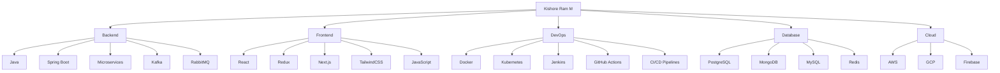

<div align="center">
  
# 👨‍💻 Kishore Ram M

### Full Stack Architect & Microservices Maestro

<a href="https://linkedin.com/in/kishoreramm"></a>
<a href="https://instagram.com/thekrm"></a>
<a href="mailto:mrkisho65@gmail.com"></a>

[](https://github.com/kishoreram-m)

</div>

<div align="center">
  
</div>

---

## ⚡ Tech Stack Powerhouse



---

## 🚀 What I'm Up To

> **Currently Architecting:** High-throughput microservices ecosystems with Spring Boot, Kafka, and Kubernetes that scale without breaking a sweat.
>
> **Deep Diving Into:** Advanced microservices patterns, event sourcing, and real-time data processing architectures.
>
> **Passion Project:** Building Batman-inspired dashboard systems that Bruce Wayne would approve of! 🦇

---

## ⚙️ My Development Arsenal

<div align="center">

| Backend | Frontend | DevOps | Database | Cloud |
|---------|----------|--------|----------|-------|
|     |     |     |     |   |

</div>

---

## 📊 GitHub Analytics

<div align="center">
  
  
</div>

<div align="center">
  
</div>

---

## 🦇 The Kishore Difference

I don't just write code - I architect digital ecosystems. When others push commits, I deploy dreams. My microservices aren't just scalable; they're transformative. Every line of code I write is poetry in Java, every API I design is a masterpiece, and every UI I build turns users into fans.

```java
@MicroserviceArchitect
public class KishoreRam implements FullStackDeveloper {
    
    @Override
    public Solution solveComplexProblems(Challenge challenge) {
        if (challenge.getDifficulty() == Difficulty.IMPOSSIBLE) {
            // This is where I shine
            return new Solution(Strategy.INNOVATIVE, Approach.SCALABLE);
        }
        return super.solveComplexProblems(challenge);
    }
}
```

---

<div align="center">
  <p><strong>Let's build something extraordinary together!</strong></p>
  <p>📫 Reach me at: <a href="mailto:mrkisho65@gmail.com">mrkisho65@gmail.com</a></p>
</div>
