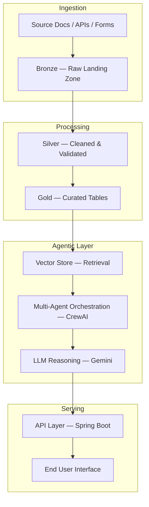

<!--
  ============================================================
  PERSONALIZE BEFORE PUBLISHING — find/replace these tokens:

  [GITHUB_USERNAME]    → your GitHub username (drives every stats/badge URL)
  [LINKEDIN_URL]        → full LinkedIn profile URL
  [EMAIL]                → your email
  [PORTFOLIO_URL]        → portfolio/website URL (or delete that button)
  [RESUME_URL]           → hosted PDF resume link (or delete that button)
  [REPO_ADMISSA]         → GitHub repo URL for Admissa / VelBot
  [REPO_OPTIVOX]         → GitHub repo URL for OptiVox DB
  [REPO_VELCARE]         → GitHub repo URL for VelTech Care
  [REPO_INSTACLAIM]      → GitHub repo URL for InstaClaim
  [LEETCODE_USERNAME]    → optional, if you want a LeetCode stats badge
  [X] anywhere            → a real number/metric only you should fill in.
                            Do not publish with fabricated numbers.
  ============================================================
-->

<div align="center">


<a href="https://github.com/[GITHUB_USERNAME]">
  
</a>

<br/><br/>

[](https://[PORTFOLIO_URL])
[](https://[LINKEDIN_URL])
[](mailto:[EMAIL])
[](https://[RESUME_URL])

<br/>


</div>

<br/>

<div align="center">

</div>

<br/>

## 🧭 About Me

I'm a final-year Computer Science undergraduate at **Vel Tech Rangarajan Dr. Sakunthala Engineering College**, Chennai (Class of 2027), building toward one specific outcome: shipping systems where **AI agents and data pipelines are the same discipline**, not two separate resume bullets.

Most people treat "agentic AI" and "data engineering" as different tracks. I don't. Every agent I've built — a multi-agent admissions assistant, a natural-language-to-SQL studio, a healthcare RAG chatbot — is only as good as the data pipeline feeding it. So I build both ends: the **Spark/Kafka/Airflow pipeline that makes data trustworthy**, and the **CrewAI/LangChain agent layer that makes it usable**, wired together through **Java Spring Boot** services that don't fall over in production.

**What I'm optimizing for right now:**
- 🎯 Fresher/intern roles in **Agentic AI Engineering**, **Data Engineering**, and **Java backend development** — GCC and BFSI companies in the Chennai corridor
- 🏗️ A Data Engineering skill track built on **GCP**, with **PySpark** and **DP-203** as near-term milestones
- ✍️ Writing technical content on **Big Data, Hadoop, and HDFS internals** to force myself to actually understand the fundamentals, not just use the frameworks

**Engineering philosophy, in short:** if it can't survive a bad input, a slow network, and a 2 AM page, it isn't done — it's a demo.

<br/>

## 🛤️ Engineering Journey


```mermaid
flowchart LR
    A["Web Development"] --> B["Game Development"]
    B --> C["Cybersecurity Fundamentals"]
    C --> D["Machine Learning"]
    D --> E["Generative AI & Agentic Systems"]
    E --> F["Data Engineering"]
    F --> G["Java Spring Boot Backend"]

    style A fill:#0F2027,stroke:#38BDF8,color:#ffffff
    style B fill:#122a37,stroke:#38BDF8,color:#ffffff
    style C fill:#163647,stroke:#38BDF8,color:#ffffff
    style D fill:#1a4257,stroke:#38BDF8,color:#ffffff
    style E fill:#234a63,stroke:#8B5CF6,color:#ffffff
    style F fill:#2c586c,stroke:#8B5CF6,color:#ffffff
    style G fill:#38648a,stroke:#00C9FF,color:#ffffff
```

Each stage left something behind: game dev taught me to think in systems and state machines, security work taught me to distrust every input, ML taught me the math under the frameworks, and GenAI is where it all converged — agents are just systems that make decisions on data, which is why data engineering became the foundation rather than a detour.

<br/>

## ⚙️ Engineering Principles

<table width="100%">
<tr>
<td width="33%" valign="top">

**Reliability & Observability**
Pipelines fail silently far more often than loudly. I design for the failure you don't notice — schema drift, partial writes, retry storms — with logging and validation baked in from the first commit, not bolted on after an incident.

</td>
<td width="33%" valign="top">

**Scalability by Design**
Code that works on 10k rows and dies on 10M rows isn't a smaller version of the real solution — it's a different problem. I prototype small but architect for the volume the system will actually see.

</td>
<td width="33%" valign="top">

**Ownership & First Principles**
I'd rather understand *why* Spark shuffles data across a stage than memorize the tuning flag that hides it. Frameworks change; the underlying distributed-systems tradeoffs don't.

</td>
</tr>
</table>

<br/>

## 🧬 Technology Ecosystem

<div align="center">

**Languages & Core**


**Backend & APIs**


**Data Engineering & Big Data**


&nbsp;


**Cloud Platforms**


**Databases & Warehousing**


&nbsp;


**Agentic AI & LLM Tooling**


**DevOps, Tools & Infra**


</div>

<br/>

## 🗺️ Data Engineering Ecosystem

<table width="100%">
<tr><th>Layer</th><th>Tools I work with</th></tr>
<tr><td><b>Processing</b></td><td>Apache Spark (PySpark), Hadoop / MapReduce fundamentals</td></tr>
<tr><td><b>Orchestration</b></td><td>Apache Airflow</td></tr>
<tr><td><b>Streaming & Messaging</b></td><td>Apache Kafka</td></tr>
<tr><td><b>Storage & Lakehouse</b></td><td>Delta Lake, GCS / S3 / ADLS, HDFS</td></tr>
<tr><td><b>Warehousing</b></td><td>BigQuery, Snowflake basics</td></tr>
<tr><td><b>Transformation</b></td><td>dbt, PySpark DataFrame API</td></tr>
<tr><td><b>Databases</b></td><td>PostgreSQL, MongoDB, Redis</td></tr>
<tr><td><b>Cloud (primary → secondary)</b></td><td>GCP → AWS → Azure</td></tr>
</table>

<br/>

## 🏗️ Architecture I Build

The pattern behind most of my projects — raw data in, an agent making grounded decisions out:


```mermaid
flowchart TB
    subgraph Ingestion["Ingestion"]
        A["Source Docs / APIs / Forms"] --> B["Bronze — Raw Landing Zone"]
    end

    subgraph Processing["Processing"]
        B --> C["Silver — Cleaned & Validated"]
        C --> D["Gold — Curated Tables"]
    end

    subgraph Agentic["Agentic Layer"]
        D --> E["Vector Store — Retrieval"]
        E --> F["Multi-Agent Orchestration — CrewAI"]
        F --> G["LLM Reasoning — Gemini"]
    end

    subgraph Serving["Serving"]
        G --> H["API Layer — Spring Boot"]
        H --> I["End User Interface"]
    end
```

This is deliberately the same shape whether the "end user" is a prospective student asking about admissions, a claims adjuster reviewing a policy, or a hospital front desk — the medallion pipeline underneath doesn't change; only the agents and the domain data do.

<br/>

## 🚀 Featured Projects

<table width="100%">
<tr>
<td width="50%" valign="top">

### 🎓 Admissa / VelBot
**Multi-agent admissions assistant with RAG**

A CrewAI-based multi-agent system that answers prospective-student admissions queries by retrieving grounded context from institutional data instead of hallucinating answers.

**Stack:** CrewAI · RAG · Vector Search · Python

**Highlights**
- Multi-agent task decomposition instead of a single monolithic prompt
- Retrieval layer grounds every answer in real admissions data
- Designed to scale from FAQ-answering to guided application support

[](https://[REPO_ADMISSA])

</td>
<td width="50%" valign="top">

### 🗄️ OptiVox DB
**NL-to-SQL agentic studio**

An agentic studio that translates natural-language questions into SQL, with an active migration of the core service from Python to **Java Spring Boot** to harden it for production use.

**Stack:** Python → Java Spring Boot · SQL · Agentic Orchestration

**Highlights**
- NL-to-SQL translation layer with schema-aware query generation
- Live migration proving the backend in a production-grade stack
- Direct test of "AI layer + hardened backend" as one system

[](https://[REPO_OPTIVOX])

</td>
</tr>
<tr>
<td width="50%" valign="top">

### 🏥 VelTech Care
**Healthcare RAG chatbot**

A retrieval-augmented chatbot built to answer healthcare-domain queries grounded in institutional documentation, applying the same RAG pattern to a domain where accuracy isn't optional.

**Stack:** RAG · Python · Vector Retrieval

**Highlights**
- Domain-grounded retrieval to minimize hallucination risk
- Applies the Admissa architecture pattern to a higher-stakes domain

[](https://[REPO_VELCARE])

</td>
<td width="50%" valign="top">

### 📋 InstaClaim
**Multi-agent insurance claims automation**

An end-to-end claims pipeline: OCR extraction → fraud detection → policy validation → straight-through processing (STP), built as a hackathon project with full architecture diagrams and agent-level prompt design.

**Stack:** Multi-Agent Pipeline · OCR · Fraud Detection · STP Engine

**Highlights**
- Each pipeline stage is an independent, auditable agent
- Designed for straight-through processing on low-risk claims, human review on flagged ones

[](https://[REPO_INSTACLAIM])

</td>
</tr>
</table>

<br/>

## 🔭 Currently Building & Learning

```text
├── Data Engineering track (GCP-first, AWS secondary)
│   ├── PySpark — deepening DataFrame API & job tuning
│   ├── DP-203 (Azure Data Engineer Associate) — near-term certification
│   └── Databricks Certified Data Engineer Associate — timed to next voucher window
├── Agentic AI Systems
│   └── Extending CrewAI multi-agent patterns into production-grade pipelines
├── Java Spring Boot
│   └── Migrating OptiVox DB's core service from Python to Spring Boot
└── Technical Writing
    └── LinkedIn series on Big Data fundamentals — HDFS architecture, Hadoop edge nodes
```

<br/>

## 📊 GitHub Analytics

<div align="center">


<br/>


<br/>


</div>

<br/>

## 🏆 Certifications & Achievements

<table width="100%">
<tr><th>Category</th><th>Detail</th></tr>
<tr><td>🎓 Certifications</td><td>DP-203: Data Engineering on Microsoft Azure — <i>in progress</i></td></tr>
<tr><td>🎓 Certifications</td><td>Databricks Certified Data Engineer Associate — <i>planned</i></td></tr>
<tr><td>💻 Problem Solving</td><td><a href="https://leetcode.com/[LEETCODE_USERNAME]">LeetCode</a> — [X]+ problems solved</td></tr>
<tr><td>🏗️ Hackathons</td><td>InstaClaim — multi-agent insurance claims automation (full pipeline + architecture)</td></tr>
<tr><td>🎓 Academics</td><td>B.E. Computer Science Engineering, Vel Tech — CGPA ~8.3, Class of 2027</td></tr>
</table>

<br/>

## ✍️ Writing

I write on LinkedIn about Big Data fundamentals — not tutorials copied from docs, but the internals I had to actually dig into: how HDFS distributes and replicates blocks, what an edge node does in a Hadoop cluster and why you need one, and the core mechanics behind distributed storage that most "learn Big Data in 30 days" content skips over.

📍 Follow along on [LinkedIn](https://[LINKEDIN_URL])

<br/>

## 🤝 Let's Connect

I'm actively looking for fresher/intern opportunities in **Agentic AI Engineering**, **Data Engineering**, or **Java Spring Boot backend roles** — particularly at GCC and BFSI organizations. If you're hiring, or just want to talk distributed systems, RAG architectures, or why HDFS block placement matters more than people think — reach out.

<div align="center">

[](https://[LINKEDIN_URL])
[](mailto:[EMAIL])
[](https://[PORTFOLIO_URL])

</div>

<br/>

<div align="center">


<i>"Every pipeline I ship is a bet that the data can be trusted. I build so that bet pays off."</i>

</div>
